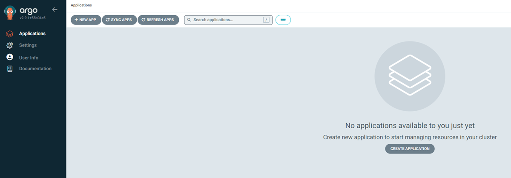

# Connecting to AKS Cluster and Installing ArgoCD

Follow these steps to connect to the new AKS cluster and install ArgoCD for continuous delivery and GitOps workflows.

## Step 1: Connect to AKS Cluster

Assuming you have the Azure CLI installed, run the following commands to connect to your AKS cluster:

```bash
# Log in to Azure
az login

# Set the AKS cluster context
az aks get-credentials --resource-group *your-resource-group* --name *your-aks-cluster-name*
```

Replace *your-resource-group* and *your-aks-cluster-name* with your actual resource group and AKS cluster name.

Run the following command:

```bash
kubectl get namespace
```

You may get prompted to browse to https://microsoft.com/devicelogin and enter a code. Proceed with these directions, and ensure the command completes without an error.

Please note that in a production environment, AKS management would be limited to a private network.

## Step 2: Install ArgoCD

Once connected to the AKS cluster, install ArgoCD using the following commands:

```bash
# Create a namespace for ArgoCD
kubectl create namespace argocd

# Install ArgoCD resources into Kubernetes
kubectl apply -n argocd -f https://raw.githubusercontent.com/argoproj/argo-cd/stable/manifests/install.yaml

# Expose ArgoCD outside the cluster
kubectl patch svc argocd-server -n argocd --type='json' -p '[{"op": "replace", "path": "/spec/type", "value": "LoadBalancer"}]'

# Get the ArgoCD administrator password (note: this value will be in base 64. [Decode it](https://www.base64decode.org/) from base 64 to get the raw password)
kubectl get secret argocd-initial-admin-secret -n argocd -o jsonpath="{.data.password}"

# Get the ArgoCD IP address to connect
kubectl get svc argocd-server -n argocd -o jsonpath="{.status.loadBalancer.ingress[0].ip}"
```

## Step 3: Connect to ArgoCD

Login to ArgoCD using this URL https://*argocd-server-ip* inserting the correct IP address from step 2. Login using the username *admin* and decoded password from step 2.





Please note that in a production environment, ArgoCD management would be limited to a private network.