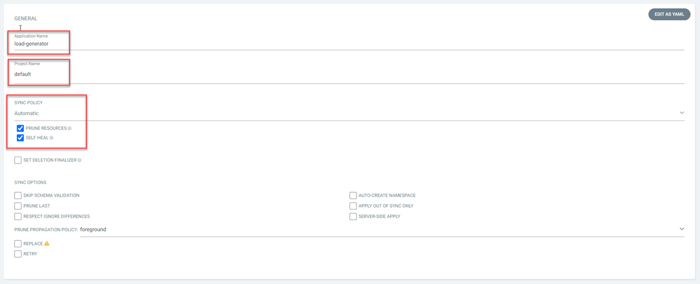
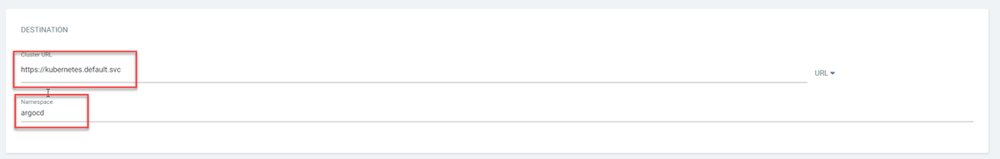
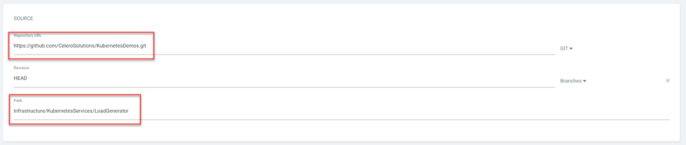

# Deploy Load Generator to AKS

Follow these steps to deploy the Load Generator to AKS.

## Step 1: Add application in ArgoCD

From the ArgoCD homepage (see [step 2](./2%20-%20Connect%20to%20AKS%20and%20Install%20ArgoCD.md) for directions), select *Create Application*:

Fill in the following sections and click *Create*. Leave all other sections blank:

**General Settings:**

- Application Name:   load-generator
- Project Name:       default
- Sync Policy:        Automatic
- Prune Resources:    Checked
- Self Heal:          Checked

**Destination Settings:**

- Cluster URL:        https://kubernetes.default.svc
- Namespace:          argocd

**Source Settings:**

- Repository URL:     https://github.com/CeleroSolutions/KubernetesDemos.git
- Path:               Infrastructure/KubernetesServices/LoadGenerator

You should see the application created on the ArgoCD home page:

