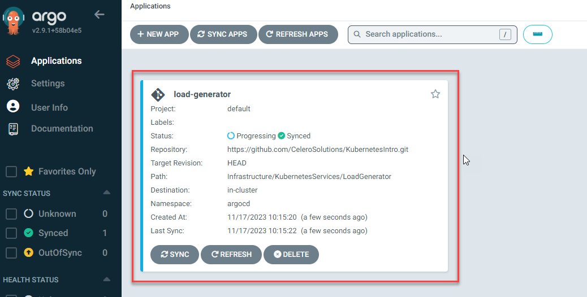
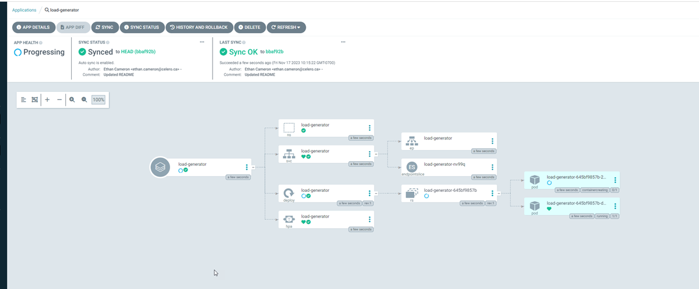
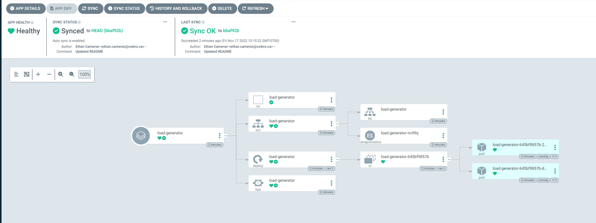
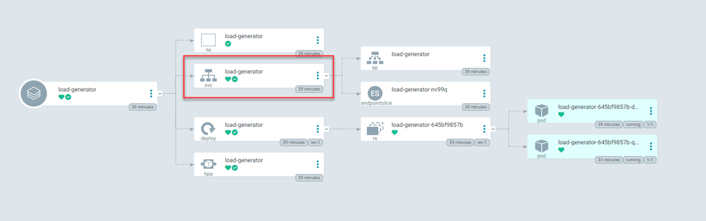
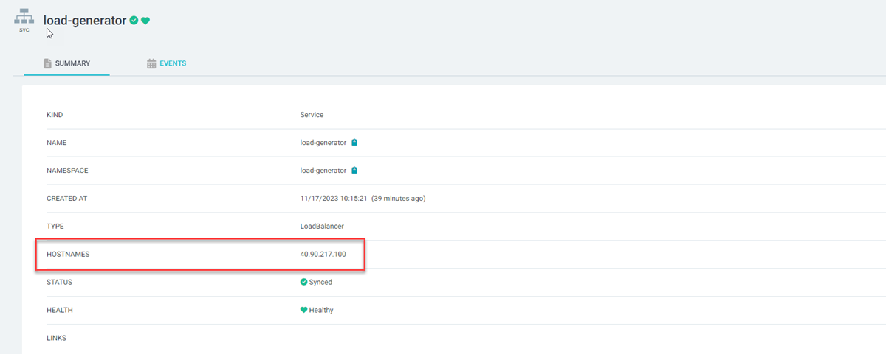
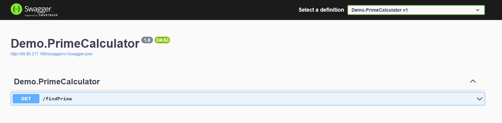

# Deploy Load Generator to AKS

Follow these steps to deploy the Load Generator to AKS.

## Step 1: Add application in ArgoCD

From the ArgoCD homepage (see [step 2](./2%20-%20Connect%20to%20AKS%20and%20Install%20ArgoCD.md) for directions), select *Create Application*:

Fill in the following sections and click *Create*. Leave all other sections blank:

**General Settings:**

- Application Name:   load-generator
- Project Name:       default
- Sync Policy:        Automatic
- Prune Resources:    Checked
- Self Heal:          Checked

**Source Settings:**

- Repository URL:     https://github.com/CeleroSolutions/KubernetesIntro.git
- Path:               Infrastructure/KubernetesServices/LoadGenerator

**Destination Settings:**

- Cluster URL:        https://kubernetes.default.svc
- Namespace:          argocd

You should see the application created on the ArgoCD home page:

 Click on the application and you should see resources being created and eventually change to healthy:

 

  

  ## Step 2: Connect to Load Generator

  Click on the Service in the application page: 
  
  
  
  Record the public IP address:

  

  Browse to *http://<ipAddress>/swagger* and confirm you see the following page:

  

Load can be generated by repeatedly calling *http://<ipAddress>/findPrime* with a tool like [Apache JMeter](https://jmeter.apache.org/)